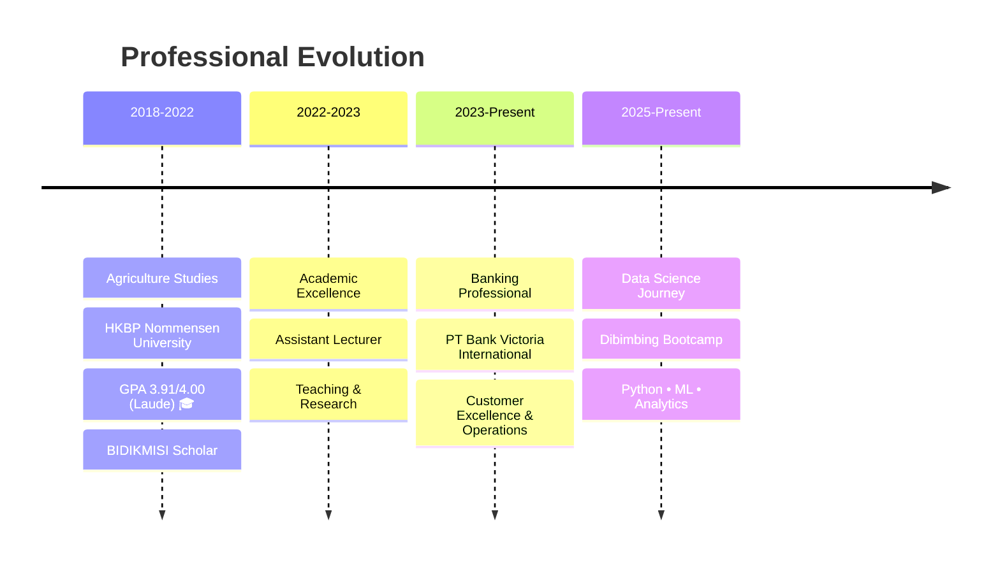

# Hi there! 👋 I'm **Fepi Efta Pioni Sidabalok**

<div align="center">
  
[](https://git.io/typing-svg)


</div>

## 🎯 **About Me**


```yaml
Name: Fepi Efta Pioni Sidabalok
Role: Data Science Enthusiast & Banking Professional
Location: Indonesia 🇮🇩
Current Focus: Transforming data into actionable insights
Philosophy: "Determination + Hard Work + Discipline + Honesty = Success"

Education:
  - Agriculture: "HKBP Nommensen University (GPA: 3.91/4.00 - Laude)"
  - Data Science: "Dibimbing Bootcamp (In Progress)"
  
Experience:
  - Banking: "PT Bank Victoria International"
  - Academia: "Assistant Lecturer"
  - Research: "Palm Oil Industry Analysis"
```

<div align="center">
  
[](https://github.com/fepi-sidabalok)
[](https://github.com/fepi-sidabalok?tab=followers)
[](https://linkedin.com/in/fepi-sidabalok)

</div>

---

## 🛠️ **Technical Arsenal**

<div align="center">

### **Programming & Data Science**
<p>


</p>

### **Visualization & Analytics**
<p>


</p>

### **Development Environment**
<p>


</p>

</div>

---

## 🎓 **Professional Journey**

<div align="center">



</div>

---

## 🏆 **Achievements & Recognition**

<table align="center">
<tr>
<td align="center" width="25%">

**🥇 Research Excellence**<br/>
*Palm Oil Research Winner*<br/>
Ministry of Finance RI<br/>
**2022**

</td>
<td align="center" width="25%">

**🧪 Science Olympiad**<br/>
*Chemistry Award*<br/>
Ministry of Education<br/>
**2021**

</td>
<td align="center" width="25%">

**📚 Academic Writing**<br/>
*National Library Writer*<br/>
Perpusnas Press<br/>
**2020**

</td>
<td align="center" width="25%">

**🧬 Biology Excellence**<br/>
*Biology Olympiad*<br/>
Ministry of Education<br/>
**2020**

</td>
</tr>
</table>

---

## 💼 **Professional Experience**

<details>
<summary><b>🏦 Bank Teller - PT Bank Victoria International</b> <i>(2023 - Present)</i></summary>

<br/>

**Key Responsibilities:**
- 💰 **Transaction Management**: Process deposits, withdrawals, and transfers with 99.9% accuracy
- 👥 **Customer Relations**: Deliver exceptional service to 50+ daily clients
- 📊 **Financial Analysis**: Support customers with account insights and recommendations
- 🔒 **Compliance**: Maintain strict adherence to banking regulations and security protocols

**Achievements:**
- Maintained zero discrepancies in cash handling for 12+ consecutive months
- Achieved customer satisfaction rating of 4.8/5.0

</details>

<details>
<summary><b>🎓 Assistant Lecturer - HKBP Nommensen University</b> <i>(2022 - 2023)</i></summary>

<br/>

**Key Contributions:**
- 👨‍🏫 **Education**: Instructed 40+ undergraduate students in agricultural sciences
- 📝 **Assessment**: Designed and evaluated academic assessments and projects
- 🔬 **Research**: Conducted research in palm oil sustainability and agricultural innovation
- 📊 **Methodology**: Taught statistical analysis and research methodology

</details>

<details>
<summary><b>🛒 Purchasing Specialist</b> <i>(March - May 2023)</i></summary>

<br/>

**Core Functions:**
- 📦 **Procurement Strategy**: Managed supplier relationships and negotiations
- 💼 **Cost Optimization**: Achieved 15% cost reduction through strategic sourcing
- 📄 **Documentation**: Streamlined procurement processes and documentation

</details>

---

## 📊 **GitHub Analytics**

<div align="center">


</div>

---

## 🎯 **Current Learning Path**


**🚀 Data Science Mastery (2025)**
- Advanced Statistical Analysis & A/B Testing
- Machine Learning Algorithms & Model Optimization  
- Deep Learning with TensorFlow & PyTorch
- Big Data Processing with Apache Spark
- MLOps & Production Deployment

**📊 Specialized Skills**
- Time Series Forecasting for Financial Markets
- Natural Language Processing for Banking
- Computer Vision for Agricultural Applications
- Predictive Analytics for Risk Assessment

**🎓 Certifications in Progress**
- Google Data Analytics Professional Certificate
- AWS Machine Learning Specialty
- Tableau Desktop Specialist

---

## 🌟 **Featured Projects**

<div align="center">

<table>
<tr>
<td width="50%">

### 🌾 **Agricultural Data Analysis**
*Palm Oil Yield Prediction Model*

**Tech Stack:** Python, Scikit-learn, Pandas<br/>
**Impact:** 85% prediction accuracy<br/>
**Recognition:** Ministry of Finance Winner 🏆

[](https://github.com/fepi-sidabalok)

</td>
<td width="50%">

### 🏦 **Banking Analytics Dashboard**
*Customer Behavior Analysis*

**Tech Stack:** Tableau, SQL, Python<br/>
**Features:** Real-time insights<br/>
**Metrics:** Customer satisfaction tracking

[](https://github.com/fepi-sidabalok)

</td>
</tr>
</table>

</div>

---

## 💡 **Philosophy & Approach**

<div>

```python
class DataScientistMindset:
    def __init__(self):
        self.core_values = {
            "curiosity": "Always ask why and what if",
            "precision": "Data doesn't lie, but interpretation matters",
            "collaboration": "Best insights come from diverse perspectives",
            "continuous_learning": "Stay curious, stay relevant"
        }
    
    def daily_routine(self):
        return [
            "🌅 Morning: Industry news and research papers",
            "💻 Work: Apply data science to real problems", 
            "📚 Evening: Learn new techniques and tools",
            "🌙 Night: Reflect and plan tomorrow's growth"
        ]
    
    def life_motto(self):
        return "Transform data into decisions, decisions into impact! 🚀"
```

</div>

---

## 🤝 **Let's Connect & Collaborate**

<div>

<a href="https://linkedin.com/in/fepi-sidabalok">

</a>
<a href="mailto:fepi.sidabalok@email.com">

</a>
<a href="https://github.com/fepi-sidabalok">

</a>

<br/><br/>

**🎯 Open to opportunities in:**
Data Science • Machine Learning • Financial Analytics • Agricultural Technology

</div>

---

<div align="center">


### 💫 *"Every dataset tells a story. My job is to listen, understand, and share its wisdom."*

**⭐ Star my repositories if they inspire you to explore data differently!**

</div>
