# Hi there! 👋 I'm Fepi Efta Pioni Sidabalok

<div align="center">
  
</div>

<div align="center">
  
</div>

## 🌟 About Me

> *"Determination, hard work, discipline and honesty are the keys to success"* ✨

I'm a **passionate Data Scientist** with a unique background in **Agriculture** and **Banking**. Currently pursuing advanced Data Science while working as a Teller at Bank Victoria International. My journey from farming to finance to data has equipped me with a diverse perspective on problem-solving and innovation.

<div align="center">
  
### 🎯 Quick Stats
  


</div>

---

## 🚀 My Journey

<div align="center">
  
  
</div>

### 📚 Education & Learning Path

```mermaid
timeline
    title My Learning Journey
    
    2018-2022 : Agriculture Degree
              : HKBP Nommensen University
              : GPA 3.91/4.00 (Laude) 🎓
              : BIDIKMISI Scholarship
              
    2023-Present : Banking Professional
                 : PT Bank Victoria International
                 : Customer Service Excellence
                 
    2025-Present : Data Science
                 : Dibimbing Bootcamp
                 : Python • SQL • Tableau
```



---

## 💻 Tech Stack & Skills

<div align="center">

### 🔧 Programming Languages


### 📊 Data Science & Analytics


### 📈 Visualization & Tools


</div>

---

## 🏆 Achievements & Awards

<div align="center">
  
| 🏅 Award | 🏛️ Organization | 📅 Year |
|----------|------------------|----------|
| **Palm Oil Research Competition Winner** | Ministry of Finance RI (BPDPKS) | 2022 |
| **Chemistry Olympiad Award** | Ministry of Education & Culture | 2021 |
| **National Library Opinion Writer** | Perpusnas Press Publisher | 2020 |
| **Biology Olympiad Award** | Ministry of Education & Culture | 2020 |

</div>

---

## 💼 Professional Experience

<details>
<summary><b>🏦 Current Role - Bank Teller (2023-Present)</b></summary>

- 💰 Processing transactions (deposits, withdrawals, transfers)
- 👥 Customer service excellence and consultation
- 📋 Compliance with banking regulations
- 🔄 Cash management and transaction facilitation

</details>

<details>
<summary><b>🛒 Purchasing Specialist (March-May 2023)</b></summary>

- 📦 Procurement and supplier negotiations
- 🤝 Supplier relationship management
- 📄 Documentation and invoice processing

</details>

<details>
<summary><b>🎓 Assistant Lecturer (2022-2023)</b></summary>

- 👨‍🏫 Teaching 40+ students
- 📝 Assessment and feedback provision
- 📊 Research methodology instruction

</details>

---

## 📊 GitHub Analytics

<div align="center">
  
  
</div>

---

## 🎯 Current Focus

<div align="center">
  
```python
class FepiSidabalok:
    def __init__(self):
        self.current_focus = [
            "📊 Advanced Data Science Techniques",
            "🤖 Machine Learning Algorithms", 
            "📈 Statistical Analysis & Hypothesis Testing",
            "🔍 Exploratory Data Analysis",
            "📱 Data Visualization Mastery"
        ]
        
    def daily_goals(self):
        return {
            "learn": "New data science concepts",
            "practice": "Python & SQL skills",
            "build": "Real-world data projects",
            "grow": "Professional network"
        }
        
    def life_motto(self):
        return "Determination + Hard Work + Discipline + Honesty = Success ✨"
```

</div>

---

## 🌐 Let's Connect!

<div align="center">
  
[](https://linkedin.com/in/fepi-sidabalok)
[](mailto:fepi.sidabalok@email.com)
[](https://github.com/fepi-sidabalok)
[](https://fepi-sidabalok.github.io)

</div>

<div align="center">
  
</div>

<div align="center">
  
</div>

---

<div align="center">
  <b>⭐ Star my repositories if you find them interesting!</b>
</div>
